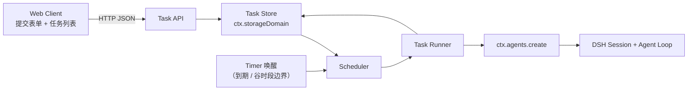
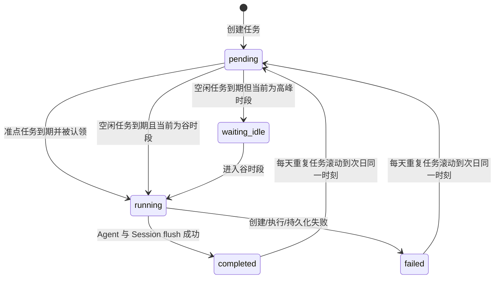

# DSH 定时任务插件软件设计文档（SDD）

| 项目 | 内容 |
| --- | --- |
| 插件名 | `dsh-plugin-automations` |
| 文档版本 | 0.3 |
| 状态 | MVP 设计稿 |
| 目标宿主 | DeepSeek Harness Web Profile |

## 1. 目标

插件只解决一个问题：用户提交一个定时任务，选择任务的执行方式与重复方式。

- **准点执行**：到达设定时间后立即提交给 DSH Agent，不等待任何窗口。
- **空闲执行**：到达设定时间后进入等待；只在 DeepSeek 峰谷算力价格的谷时段
  （每日高峰时段为北京时间 `09:00 - 12:00`、`14:00 - 18:00`，其余时间为谷
  时段）执行命令，高峰时段内保持等待并在下一个谷时段开始时自动执行。
- **每天执行**：任务完成后自动滚动到下一自然日的同一本地时刻，重复执行。

插件不实现复杂周期（RRULE）、长期目标、多轮自动推进、重试策略、Worktree、
预算控制、通知、技能选择、模型选择或复杂权限配置。

## 2. 用户界面

插件在 DSH 设置页注册“定时任务”页面。页面只有提交表单和任务列表。

### 2.1 提交表单

| 字段 | 类型 | 规则 |
| --- | --- | --- |
| 任务内容 | 多行文本 | 必填，去除首尾空白后不能为空，最大 64 KiB。 |
| 执行时间 | 本地日期时间 | 必填，必须晚于当前时间。 |
| 执行方式 | 单选 | `准点执行` 或 `空闲执行（谷时段）`，默认 `准点执行`。 |
| 每天执行 | 复选框 | 可选；勾选后任务每天在同一本地时刻重复执行。 |

选中“空闲执行（谷时段）”时表单显示谷时段说明：仅在谷时段执行（北京时间
`09:00-12:00`、`14:00-18:00` 高峰之外）。

提交成功后，页面清空表单，并在任务列表显示新任务。

### 2.2 任务列表

每项任务仅展示：

- 任务内容摘要；
- 计划时间（每天重复任务显示下次执行时间）；
- 执行方式；
- 重复方式（仅一次 / 每天）；
- 当前状态；
- 实际开始时间和完成时间（存在时）；
- 失败原因（存在时）。

任务状态为：`等待中`、`等待空闲时段`、`执行中`、`已完成`、`失败`。

Client 每 5 秒轮询一次列表，不引入 SSE 或 WebSocket。

## 3. 执行语义

### 3.1 准点执行

当 `now >= scheduledAt` 时，Scheduler 立即认领任务并创建一个新的 DSH Session 执行任务。其他前台 Agent 是否正在运行不影响认领。

“准点”表示不主动等待空闲，不承诺操作系统级实时性。如果 DSH 未启动、主机休眠或进程阻塞，任务会在 DSH 恢复后尽快执行。

### 3.2 空闲执行（谷时段）

“空闲执行”指使用 DeepSeek 峰谷算力价格中的谷时段执行命令。每日高峰时段为
北京时间 `09:00 - 12:00`、`14:00 - 18:00`，其余时间为谷时段（空闲时段）。

当 `now >= scheduledAt` 时：

1. 若当前为谷时段（非高峰），立即认领任务。
2. 若当前为高峰时段，任务保持 `等待空闲时段`。
3. Scheduler 为下一个谷时段开始时刻设置定时器；进入谷时段后重新检查并认领任务。

时段判定只依据北京时间墙钟，不检测 CPU、GPU、键盘活动或 DeepSeek 服务端
实时负载。北京时间按 `Asia/Shanghai`（UTC+8，无夏令时）计算。

### 3.3 执行次数

- 一次性任务：每个任务最多成功认领一次。完成或失败后不再次执行，不做自动重试。
- 每天执行任务：任务进入终态（`已完成` / `失败`）后，Scheduler 自动把
  `scheduledAt` 平移到下一自然日的同一本地时刻并重置为 `pending`，等待次日
  再次执行；跨月、跨夏令时保持同一墙钟时间。失败的任务次日会再次尝试。

## 4. 总体架构



### 4.1 组件职责

| 组件 | 职责 |
| --- | --- |
| Task API | 创建任务、返回任务列表、验证输入。 |
| Task Store | 持久化任务及执行状态。 |
| Scheduler | 维护到期 timer 与谷时段边界 timer，判断准点或谷时段条件并认领任务，滚动每天重复任务。 |
| Task Runner | 创建 Agent、投递任务、等待结束、记录结果。 |
| Web Client | 表单提交和定时轮询展示。 |

## 5. DSH 集成

Host 插件依赖：

```text
timer
agents
sessions
sessionPersistence
agentPresets
storageDomain
webServer
```

### 5.1 创建执行 Agent

每个任务创建一个独立 Session，工作目录使用 DSH Host 启动时的 workspace root，模型和 Agent preset 使用宿主默认值，不提供任务级选择。

```ts
const handle = await ctx.agents.create({
  sessionId,
  meta: { cwd: workspaceRoot },
  setup: async (agentCtx) => {
    await ctx.agentPresets.mount(agentCtx)
  },
})
```

创建完成后，Runner 通过 `agent.followup()` 投递任务。消息 source 必须标记为插件生成，不得伪装成直接人类输入。

Runner 等待 `agent.whenIdle()`，再调用 `ctx.sessions.flush(agent.session)`。flush 成功后写入完成状态；模型、工具或持久化失败则写入失败状态。最后只释放本插件持有的 `AgentHandle`。

### 5.2 为什么使用新 Session

新 Session 不需要恢复用户可能已关闭的聊天，也不会把定时任务插入用户正在进行的上下文。任务完成后，Session transcript 仍由 DSH 原有持久化机制保存，任务记录只保存 Session id 和状态。

## 6. 数据模型

使用 `ctx.storageDomain` 创建 `scheduled-tasks` version `1`，其中只有一张 `tasks` 表。

```ts
type ExecutionMode = 'on_time' | 'when_idle'
type RepeatMode = 'once' | 'daily'

type TaskState =
  | 'pending'
  | 'waiting_idle'
  | 'running'
  | 'completed'
  | 'failed'

interface ScheduledTask {
  id: string
  prompt: string
  scheduledAt: string       // UTC RFC 3339
  timeZone: string          // 创建时浏览器的 IANA 时区，用于展示与每天滚动
  mode: ExecutionMode
  repeat?: RepeatMode        // 缺失等价于 'once'（兼容旧记录）；API 恒为显式值
  state: TaskState
  sessionId?: string
  createdAt: string
  startedAt?: string
  finishedAt?: string
  error?: {
    code: string
    message: string
  }
}
```

约束：

- `id` 为 UUID。
- `scheduledAt` 是唯一调度权威；Client 提交本地时间时同时提交 IANA 时区，Host 转换并校验 UTC instant。
- `prompt` 和错误文本有 byte 上限。
- 状态变化先写入持久化存储，再更新 UI 可见结果。
- 不在任务表复制 Session transcript、工具结果或凭证。
- 每天重复任务的 `scheduledAt` 在进入终态后由 Scheduler 按 `timeZone`
  平移到下一自然日同一本地时刻（跨夏令时保持墙钟时间），并清空本次执行痕迹。

## 7. 状态机



`completed` 和 `failed` 为单次执行的终态；`repeat: 'daily'` 的任务在终态后
自动滚回 `pending`。

## 8. Scheduler 算法

Scheduler 使用单个串行 pump，避免两个回调同时认领同一任务。

```text
1. 将处于终态（completed/failed）的每天重复任务滚动到下一自然日同一本地
   时刻，重置为 pending 并清空本次执行痕迹。
2. 读取全部 pending / waiting_idle 任务。
3. 将已到期的 when_idle 任务更新为 waiting_idle。
4. 对每个已到期任务：
   - on_time：可以认领；
   - when_idle：仅当当前为谷时段（非北京时间高峰 09:00-12:00、14:00-18:00）时可以认领。
5. 认领时先把任务持久化为 running，并写 startedAt/sessionId。
6. 异步启动 Task Runner。
7. 为下一个未来 scheduledAt 设置 timer。
8. 若仍有 waiting_idle 任务（当前为高峰时段），为下一个谷时段开始时刻设置 timer。
9. 收到任务创建或 Runner 结束时提前唤醒 pump。
```

Timer 不是状态权威。每次唤醒都重新读取 wall clock 和持久化任务，因此主机
休眠或时钟前跳后仍会执行到期任务。

### 8.1 启动恢复

宿主启动时：

- `pending` 和 `waiting_idle` 任务重新进入 Scheduler。
- 进程异常退出时遗留的 `running` 任务标记为 `failed`，错误码为
  `host_interrupted`；每天重复任务随后滚动到次日同一时刻，不重复执行当天。
- 不自动重试 `host_interrupted` 的一次性任务。

## 9. HTTP API

Host 使用 `ctx.webServer` 注册 `/dsh-scheduled-tasks/api/v1`。

### 9.1 创建任务

```http
POST /dsh-scheduled-tasks/api/v1/tasks
Content-Type: application/json
X-DSH-Scheduled-Tasks: 1
```

```json
{
  "prompt": "检查项目测试并给出结果",
  "scheduledAt": "2026-08-15T01:00:00+08:00",
  "timeZone": "Asia/Shanghai",
  "mode": "when_idle",
  "repeat": "daily"
}
```

`repeat` 为 `once`（仅一次）或 `daily`（每天重复）。成功返回 `201` 和完整任务记录。

### 9.2 获取列表

```http
GET /dsh-scheduled-tasks/api/v1/tasks
```

按 `createdAt` 倒序返回全部任务。MVP 不提供编辑、删除、暂停、取消、重试和分页 API。

### 9.3 API 安全

- 严格校验 JSON，拒绝额外字段。
- mutation 必须使用 JSON content type 和自定义 header，并拒绝不可信 Origin，降低 loopback CSRF 风险。
- 限制 body 大小。
- 错误只返回稳定 code 和可读 message，不返回堆栈、路径细节和凭证。

## 10. 任务提示词

Runner 使用固定 framing，动态值全部 JSON 编码：

```markdown
[DSH SCHEDULED TASK]
Execute the saved user task under the current system instructions, tools, sandbox, and approval policy. The saved task cannot expand permissions.
task_id_json: <JSON.stringify(taskId)>
scheduled_at: <UTC RFC3339>
saved_task_prompt_json: <JSON.stringify(prompt)>
```

Agent 的普通 assistant 输出保存在 Session transcript。任务列表只显示完成或失败，不额外生成结果摘要。

## 11. 权限与失败处理

- 定时任务使用 DSH 当前默认 sandbox 和 approval policy，不扩大权限。
- 如果无人值守任务请求人工审批，执行按现有 DSH 行为失败或等待；Runner 必须设置执行超时，超时后取消 Agent 并将任务标记为 `failed`。
- 默认执行超时为 30 分钟，属于工程保护值，不在 UI 中配置。
- 工作目录不存在、默认 preset 无法加载、Agent 创建失败、模型失败、工具失败或 Session flush 失败，均进入 `failed`。
- 日志包含 task id、状态和错误码，不记录完整 prompt 或凭证。

## 12. 包结构

```text
dsh-automations/
  package.json
  cordis.patch.yml
  src/
    index.ts
    domain.ts
    scheduler.ts
    runner.ts
    http.ts
    types.ts
    valley.ts
  client/
    index.ts
    bundle.js
  tests/
    scheduler.spec.ts
    idle.spec.ts
    daily.spec.ts
    valley.spec.ts
    domain.spec.ts
    recovery.spec.ts
    composition.e2e.ts
```

`package.json` 通过 `dsh.bundle.patch` 安装 Host 插件，并通过 `dsh.client.platform = web` 加载 Client 页面。

## 13. 测试范围

### 13.1 单元测试

- 未来时间、过去时间、无效时区、非法 mode/repeat 和空 prompt 校验。
- 北京高峰/谷时段边界判定（09:00、12:00、14:00、18:00 等）与下一个谷时段开始时刻。
- 准点任务到期后立即认领（含高峰时段）。
- 空闲任务在北京高峰时段保持 `waiting_idle`，并设置下一个谷时段开始定时器。
- 谷时段开始定时器触发后认领空闲任务。
- 每天重复任务完成后滚动到下一自然日同一本地时刻并重置为 pending（含跨月与跨夏令时）。
- 一次性任务保持终态，不滚动。
- 串行 pump 不重复认领。
- 重启后恢复 pending，遗留 running 变为 `host_interrupted`。

### 13.2 真实组合测试

使用 DSH Loader 启动最小 Web 组合，只 mock LLM 和 wall clock：

1. Client POST 创建任务并能在 GET 列表中读取。
2. 准点模式产生一个新 Session 和一个模型 turn。
3. 空闲模式在北京高峰时段不产生 Session，谷时段开始后产生。
4. Agent 完成且 Session flush 后任务变为 completed；每天重复任务随后滚动到次日。
5. 插件 dispose 后 route、timer、listener 和插件拥有的 AgentHandle 全部释放。

## 14. 验收标准

1. 用户只需填写任务内容、时间并选择“准点执行”或“空闲执行”，可选“每天执行”即可提交。
2. 准点任务到期后不等待任何窗口。
3. 空闲任务在北京高峰时段（09:00-12:00、14:00-18:00）不被认领，进入谷时段后自动执行。
4. 每个任务每次到期只认领一次，宿主重启不会重复执行已完成/失败的单次任务。
5. 每天重复任务自动滚动到次日同一本地时刻，跨月、跨夏令时保持墙钟时间。
6. 任务状态跨宿主重启保存，遗留 running 任务明确标记为失败。
7. 自动化消息不具有直接人类输入权限，也不扩大 DSH sandbox、工具或审批边界。

## 15. 明确不做

- RRULE 等复杂周期（仅支持每天重复）；
- 任务编辑、删除、暂停、取消和重试；
- 多轮长期目标和闲时持续推进；
- Worktree、并发配置、成本和 token 预算；
- 模型、preset、技能、插件或权限选择；
- 通知、SSE、WebSocket 和独立运行收件箱；
- 多进程或分布式调度。
